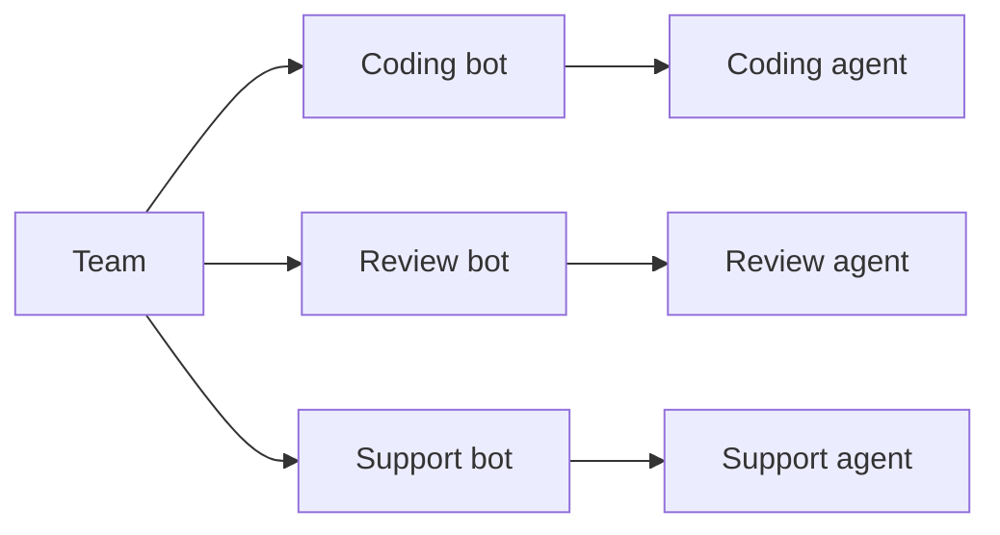
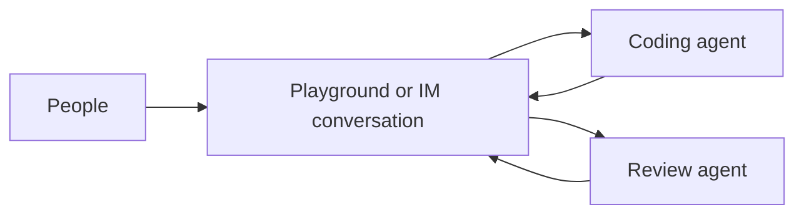
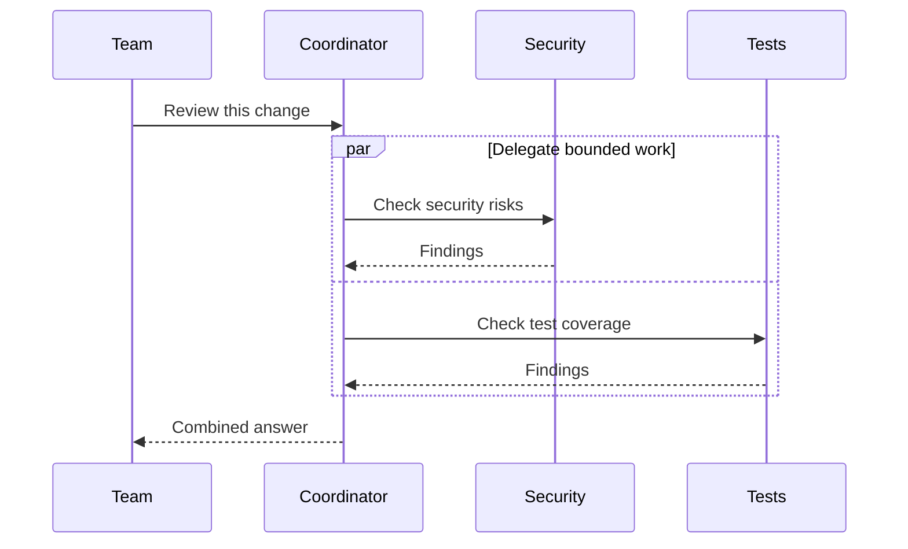
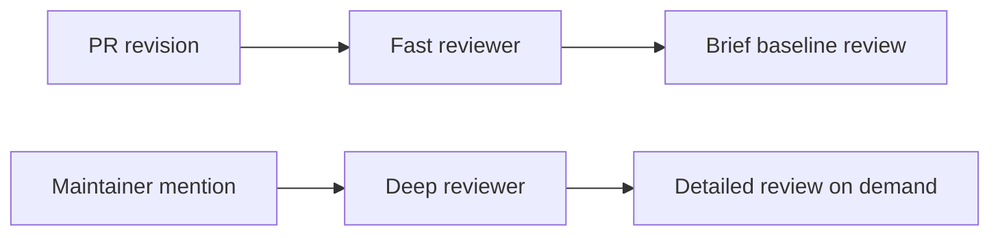
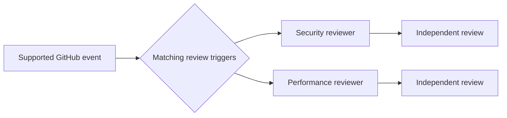
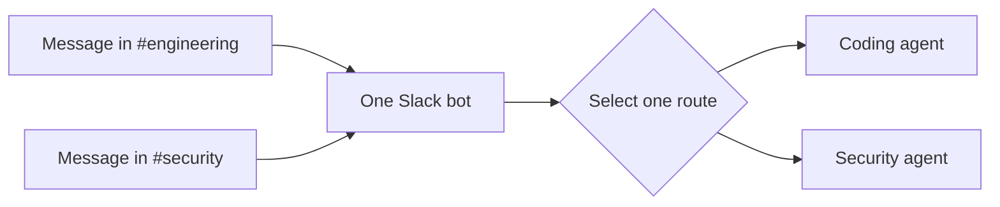

import imgPlayground from '@/public/images/playground.png'
import imgAgentTopology from '@/public/images/agent-topology.png'

AgentConnect 为由专项 Agent 组成的团队而设计。对大多数团队来说，最好的起点是几个各有专注的 Agent，每个都连接到自己的机器人或集成。当人们想同时与多个 Agent 协作时，把它们带进同一个对话；当某个 Agent 需要协调整体工作时，再加入 Agent 之间的委派。

<Image src={imgPlayground} alt="首页输入框中选择了多个 Agent，用于同一个 Playground 对话" width={780} />

分层的专项 Agent 是常见的下一步，尤其适用于 Pull Request 评审。当某个工作流明确需要并行的意见或一个统一的平台身份时，触发器扇出和共享机器人路由会派上用场。

| 起点 | 工作模式 | Agent 运行方式 | 典型用途 |
| --- | --- | --- | --- |
| 默认 | 专项 Agent | 被指名的一个 Agent | 基于角色的 Agent 团队 |
| 直接协作 | 共享对话 | 多个 Agent 一起 | 实时比较或协作 |
| 核心协作 | Agent 委派 | 父 Agent 与工作 Agent | 协调子任务 |
| 常见工作流 | 分层专项 Agent | 每个请求一个 | 快速与深度 PR 评审 |
| 并行分析 | 触发器扇出 | 多个 Agent 各自独立 | 独立评审 |
| 高级路由 | 共享机器人路由 | 被路由到的一个 Agent | 一个机器人跨多个频道 |

出现在聊天平台或 GitHub 上的身份并不决定 Agent 可以访问哪些资源。在每种模式下，每个 Agent 都保留自己的配置和权限边界。

## 专项 Agent [#specialized-agents]

**从这里开始**。为不同的职责创建独立的 Agent，例如实现、安全评审、支持和发布运维。由人、定时任务、Webhook 或集成触发器直接指名相应的 Agent。

每条路径都保留自己的集成身份、Agent 配置和会话。在某个工作流刻意把它们连接起来之前，这些 Agent 各自独立工作。

当各角色服务于不同的团队或工作流、且它们的输出不需要合并时，使用这种模式。从[创建 Agent](/build-your-team/agents/create-an-agent)开始，然后在[配置 Agent](/build-your-team/agents/configure-an-agent)中为每个 Agent 设定专注的人设和环境。

## 共享对话 [#shared-conversation]

**用于直接协作**。把多个 Agent 带进同一个 Playground（控制台中显示为“试用”）或 IM 对话，一起观看它们的工作。支持的聊天平台有 Slack、Telegram、Discord 和 Lark / 飞书。

Playground 中没有明确提及的消息会到达每个参与者；`@AgentName` 会把该轮次限定到被点名的 Agent。在聊天平台中，通过 Agent 的机器人身份和常规的对话触发规则来指名 Agent。每个 Agent 都保留自己的配置和会话，而控制台把各参与者的工作呈现为一个对话。

当人们希望 Agent 实时比较方案或贡献不同专长时，使用这种模式。如果需要一个 Agent 来协调其他 Agent，请使用下面的委派。对话行为参见 [Playground](/build-your-team/agents/playground) 和[会话](/operate-govern/sessions)。

## Agent 之间的委派 [#agent-to-agent-delegation]

**用于协作**。一个 Agent 可以把有明确边界的工作分派给一个或多个经策略允许的同伴 Agent。例如，协调者可以让不同的 Agent 并行检查安全、测试和迁移，收集它们的结果，然后向团队返回一份汇总。

<Image src={imgAgentTopology} alt="Agent 页面的拓扑视图：双方策略都允许的每一条调用路径" width={900} />

每个工作 Agent 都以自己的 Agent 配置在独立的会话中运行，并把所请求的结果汇报给协调者。协调者可以合并这些结果，或继续推进工作流。委派可以仅在 Agent 之间直接进行，也可以刻意在频道或线程中发帖，让团队看到这次交接。

权限边界是有方向的：

1. 调用方的出站策略必须允许该工作 Agent。
2. 工作 Agent 的入站策略必须允许该调用方。
3. 两个 Agent 必须属于同一个组织。

平台成员身份不等于 Agent 调用授权：处于同一个频道既不授予也不阻止 Agent 之间的调用，这只由上述两条策略决定。

被委派的子会话继承父会话的受众。能读取该受众的成员即使在工作 Agent 不在其团队可见范围内时，也可以跟进子会话。这只会暴露子会话和一个简单的 Agent 名称标签；不会暴露工作 Agent 的 Agent 页面、配置、工作区或控制项。

在聊天对话中对另一个 Agent 的机器人进行可见的提及，也可以把该同伴带进线程。常规的对话触发规则仍然适用，而 Agent 可见范围策略决定是否允许直接委派。

当一个 Agent 应当主导计划、而另一个 Agent 贡献某个具体结果时，使用这种模式。调用策略参见 [Agent 可见范围](/operate-govern/permissions-overview/agent-visibility)，会话记录和受众边界参见[会话](/operate-govern/sessions)。

## 分层或按需的专项 Agent [#layered-or-on-demand-specialists]

**PR 评审的常用模式**。把日常工作交给一个快速的 Agent，只在任务确有必要时才运行更强的专项 Agent。每个请求仍然只选择一个评审者；各层的区别在于节奏和深度，而不是共享同一个会话。

一个受支持的例子是 Pull Request 评审：快速评审者可以覆盖每一次修订，而深度评审者只在获得授权的维护者提及其 AgentConnect 名称时才运行。两者可以使用同一个 GitHub App，但保留各自独立的模型、指令、会话和评审输出。提及 App 本身是广播形式，可以运行所有匹配的评审者。

当广泛的自动覆盖很重要、而昂贵的分析应当保持刻意为之时，使用这种模式。请参考[快速 PR 评审与按需深度评审](/how-to-guides/fast-and-deep-pr-reviews)。

## 并行评审或触发器扇出 [#parallel-review-or-trigger-fan-out]

**当你想要独立意见时使用**。受支持的集成可以有意把同一个事件分发给多个 Agent。每个 Agent 在自己的会话中独立处理该事件；共享一个 GitHub App 并不会合并它们的推理、权限或结果。

GitHub 评审是当前的例子。App 级别的提及可以运行该仓库所有匹配的评审者，而 Agent 名称的提及只针对一个评审者。即使 GitHub 上显示的操作者是共享的 App，每次评审仍归属于其 AgentConnect Agent。

扇出必须在集成和触发器配置中明确启用。把多个 Agent 连接到同一个仓库或频道并不会让每个事件都变成广播。

当独立的视角比单一的协调答案更有用时，使用这种模式。如果需要合并后的结果，请改用委派。

## 共享机器人与上下文路由 [#shared-bot-with-contextual-routing]

**作为高级路由选项使用**。多个 Agent 可以共享一个平台机器人身份，由频道和线程路由为每条入站消息选择 Agent。一条消息只运行 **一个 Agent**；这是路由，而不是广播式协作。

例如，一个 Slack 应用可以把 `#engineering` 路由到编码 Agent，把 `#security` 路由到评审 Agent。回复仍然以共享的 Slack 机器人身份出现，但每个 AgentConnect Agent 都保留自己的会话、Runtime、模型、工作区、记忆、工具和权限。

只有当人们应该只记住一个机器人身份、而不同对话又需要专门的行为时，才使用这种模式。对大多数团队来说，为每个 Agent 使用单独的机器人更容易理解和运维。请参考[一个 Slack 应用按频道使用不同的 Agent](/how-to-guides/one-slack-app-across-channels)。

## 跨平台交接是另一回事 [#cross-platform-handoff-is-different]

一个连接到 Slack、Telegram、Discord 或 Lark / 飞书的单个 Agent，可以在 **你信任的两个消息工作区** 之间转移任务。这是跨平台交接，而不是多 Agent 协作：同一个 Agent 拥有两侧，而源端和目标端仍然是彼此独立但相互关联的会话。

在跨平台边界转移信息之前，请先参考[在可信工作区之间交接对话](/how-to-guides/hand-off-conversations-across-messaging-platforms)。

## 保持各层权限相互独立 [#keep-the-permission-layers-separate]

组合工作模式绝不会合并它们的信任边界：

- **平台访问** 控制机器人或 App 可以触达哪些仓库、工作区、频道和人。
- **团队可见范围** 控制哪些人可以找到并管理某个 AgentConnect 资源。
- **Agent 可见范围** 控制哪些 Agent 可以相互调用。
- **会话可见范围** 控制谁可以读取某次运行及其会话记录。
- **Runtime 权限和沙箱隔离** 控制运行中的进程可以做什么。

完整的模型参见[权限](/operate-govern/permissions-overview)。一种常见的组合是：先用上下文路由选择一个专项 Agent，当该专项 Agent 需要另一个 Agent 的帮助时再进行明确的委派。
