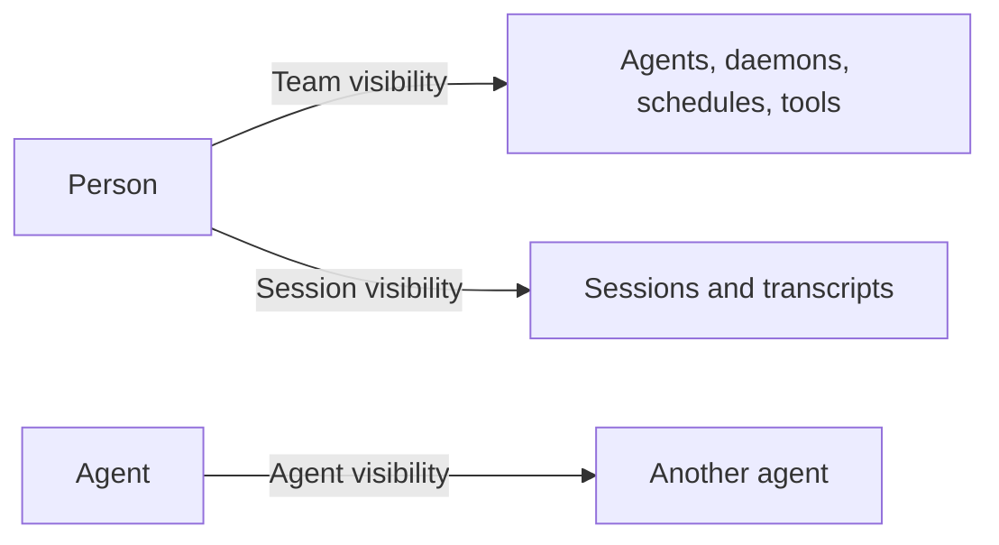

import imgAgentVisibilityDefault from '@/public/images/agent-visibility-default.png'
import imgSessionAccess from '@/public/images/session-access.png'

AgentConnect 中的一切都属于某个**组织**。成员资格是外层边界，成员的[角色](/operate-govern/permissions-overview/members-and-roles)决定他们可以执行哪一类操作。在这个边界之内，三条相互独立的轴决定谁能触达什么：

三者都叫作*可见范围*，所以请按其主语来理解。团队可见范围和会话可见范围决定**人**可以触达什么；Agent 可见范围决定哪些 **Agent** 可以相互调用，任何人的访问权限都不由它推导而来。

各轴之间没有继承关系。被允许查看某个 Agent 的人不能自动读取其会话。被允许读取某个会话的人不会因此获得该 Agent 的页面、配置、工作区或调用控件——控制台可能会把 Agent 名称显示为普通的会话上下文，但绝不会显示为链接。允许一个 Agent 调用另一个 Agent，不会让任何一方获得某个人已限制的资源。

## 三条轴 [#the-three-axes]

每条轴的形式相同：一个组织范围的默认值，以及一个覆盖它的按资源选择。

| 轴 | 谁触达什么 | 组织默认值 | 按资源选择 |
| --- | --- | --- | --- |
| [团队可见范围](/operate-govern/permissions-overview/team-visibility) | 人 → Agent、Daemon、定时任务、MCP 提供方或技能来源 | 所有人 | **所有人**或**指定成员** |
| [会话可见范围](/operate-govern/permissions-overview/session-visibility) | 人 → 单个会话及其会话记录 | **会话访问权限**，默认关闭 | **所有人**或**私密**；提供方可见对象为只读 |
| [Agent 可见范围](/operate-govern/permissions-overview/agent-visibility) | Agent → 另一个 Agent | **默认 Agent 可见性**，默认为所有 Agent | 入站和出站对等 Agent 列表 |

组织所有者可以查看和编辑每一项团队资源，包括其**指定成员**列表中不包含他们的资源。这不会覆盖[会话可见范围](/operate-govern/permissions-overview/session-visibility)：私密会话和受提供方限制的会话对每种角色都保持各自的可见对象。

所有者还会获得整个组织的完整[用量归属](/operate-govern/billing-and-usage#who-sees-what)。看到汇总支出并不授予对其背后会话的访问权限。

## 组织默认值 [#organization-defaults]

**设置**页面上的两张卡片决定新建 Agent 和新会话的初始状态。只有组织所有者可以更改它们，它们也是让整个组织默认开放或默认封闭的最快方式。

### 默认 Agent 可见性 [#default-agent-visibility]

<Image src={imgAgentVisibilityDefault} alt="组织设置中的“默认 Agent 可见性”卡片，提供“所有 Agent”或“隔离”两个选项" width={760} />

这张卡片决定新建 Agent 创建时所采用的 Agent 间调用策略：

- **所有 Agent**——新建的 Agent 可以发现并调用每一个本来可被调用的对等 Agent，并接受它们所有的调用。当你的 Agent 作为一个协作团队工作时选择此项。
- **隔离**——新建的 Agent 在两个方向上都以**已选择**且列表为空的状态开始。在有人配置它之前，它不会发现任何对等 Agent，也不接受任何对等 Agent 的调用。当每一条委派边都应当是刻意设置的时选择此项。

该设置只适用于更改之后创建的 Agent。它绝不会改写现有 Agent 的策略，而且**添加 Agent → 访问权限**仍可以在创建前覆盖任一方向。请参阅 [Agent 可见范围](/operate-govern/permissions-overview/agent-visibility)。

### 会话访问权限 [#session-access]

<Image src={imgSessionAccess} alt="组织设置中的“会话访问权限”卡片，每个平台各有一个“遵循平台访问权限”开关" width={760} />

这张卡片决定来自某个平台的会话是否遵循该平台自身的访问规则，而不是按来源的常规默认值：

- **关闭**，即默认值——每个新会话根据其启动位置设为**所有人**或**私密**。请参阅[默认可见对象表](/operate-govern/permissions-overview/session-visibility#default-audience)。
- **遵循 Slack 访问权限**——Slack 频道或群组私信会话要求来自同一工作区的已关联 Slack 身份，且当前对源对话具有访问权限。
- **遵循 GitHub 访问权限**——私有仓库会话要求已关联的 GitHub 个人资料当前对该仓库具有访问权限。公开仓库会话对每位成员保持可用。
- **遵循飞书 / Lark 访问权限**——可见对象遵循源聊天的当前成员资格，包括一对一聊天。目前这需要自托管部署。

提供方可见对象在会话本身上是只读的：请更改这项组织设置，而不是重新归类某一位参与者的副本。每项提供方检查都需要匹配的[关联账号](/how-to-guides/linked-accounts)；组织成员资格、所有者角色和个人 API 密钥都不能替代它。请参阅[会话可见范围](/operate-govern/permissions-overview/session-visibility)。

## 相互独立的权限 [#permissions-that-are-separate]

有几项控制使用了相似的词语，但保护的是不同的边界：

- Agent 的**权限模式**控制其 Runtime 在一次运行中无需询问即可做什么。
- [沙箱隔离](/operate-govern/sandboxing)把 Runtime 放进一个外层的 Linux 操作系统边界中，并限制其文件系统访问。
- 工作区的**仓库访问权限**控制 Agent 通过 GitHub App 拥有的是只读还是读写访问权限。
- 平台应用的权限范围控制 Slack、Discord、Telegram、Lark 或 GitHub 应用在该提供方处可以做什么。
- 工具、技能、密钥和 Daemon 的配置控制哪些能力会到达 Agent 进程。

这些控制与上面的各轴叠加组合。在控制台中看到某个 Agent 并不授予对其仓库的写权限，允许一个 Agent 调用另一个 Agent 也不会让任何一方获得受限团队资源的访问权限。

## 一条实用的经验法则 [#a-useful-rule-of-thumb]

用角色划分宽泛的职责，用团队可见范围控制对团队资源的直接访问，用会话可见范围保护会话记录的隐私，用 Agent 可见范围管理 Agent 之间的协作图。把一个 Agent 和它的会话视为两个独立的授权目标。
