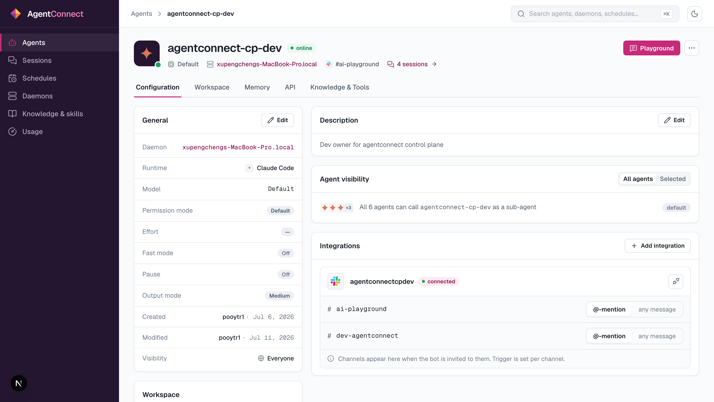

Open any agent from **Agents** to reach its page: status, meta chips (model, daemon, integrations, session count), a **Playground** button, and tabs — **Configuration**, **Workspace**, **Memory**, **API**, **Knowledge & Tools**.

## General

**Edit** on the General card changes anything you set at creation (except workspace mode and daemon): display name, model, effort/reasoning, fast mode, permission mode — plus one field that only exists here:

- **Output mode** — **Low / Medium / High**: how much of the agent's activity is posted back to the platform. **Low** posts final answers; **High** narrates tool use and progress. Chat channels usually want Low or Medium; the full detail is always in [Sessions](/docs/sessions) regardless.

## Pause

**Pause** (⋯ menu) stops the agent from processing new messages without deleting anything — integrations stay bound, history stays. Unpause to resume.

## Environment variables

The **Environment** card sets env vars for the agent's sessions on the daemon — API endpoints, feature flags, anything its tools need. Values live with the agent config on your daemon.

## Agent visibility (sub-agent calls)

Agents can call each other as sub-agents. The **Agent visibility** card controls who may call *this* one:

- **All agents** (default) — any agent in the org can delegate to it.
- **Selected** — only the agents you pick.

This is about agent-to-agent calls; who can *see* the agent is [Visibility & sharing](/docs/visibility-and-sharing).

## Memory

The **Memory** tab shows the agent's persistent memory and lets you edit it — useful for standing instructions ("our deploy window is Friday 10:00") without touching the workspace. The backend (Managed / Native) was chosen at creation.

## API

The **API** tab shows how to talk to this agent from your own code: you mint a short-lived conversation token over REST (authenticated with an [API key](/docs/api-keys)), then open a WebSocket to the returned relay URL and stream the run — `ready`, `ack`, `output`, `done`, `error` events. Message content flows between you, the relay and the daemon; it never passes through the control plane. The tab includes a copy-paste JavaScript snippet wired to this agent's IDs.

For the REST surface (agents, sessions, schedules — everything the console does), see the [API reference](/reference).

## Knowledge & Tools

Shows the MCP servers available from the daemon runtime and anything indexed from the workspace (loaded on first clone and on each pull).

## Delete

**Delete** (⋯ menu) removes the agent from the org. Its integrations are released (bots become reusable) and its workspace directory stays on the daemon's disk until cleaned up there.
