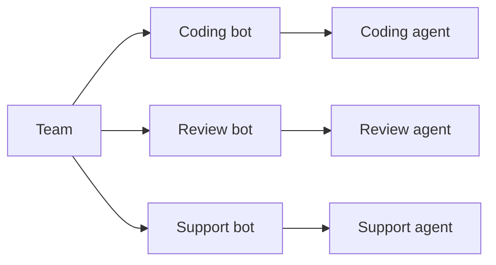
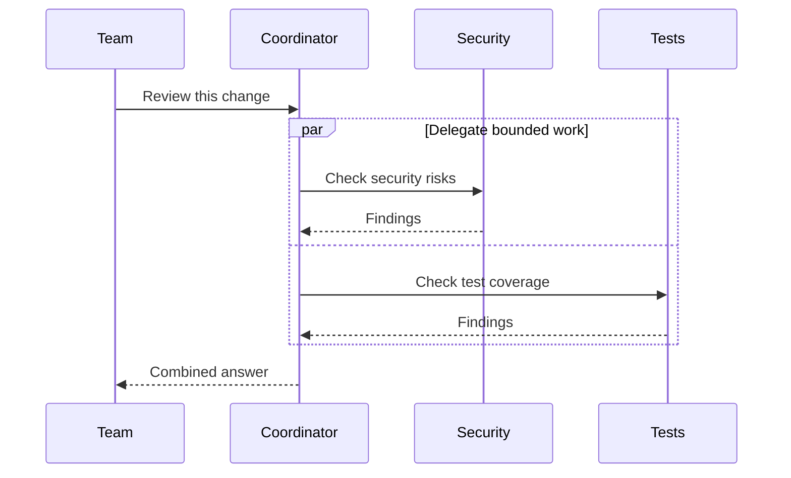
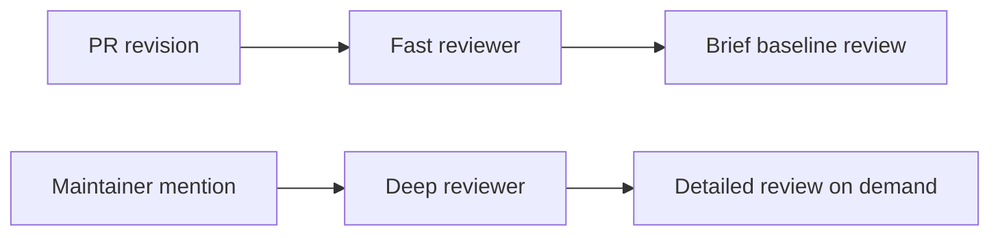
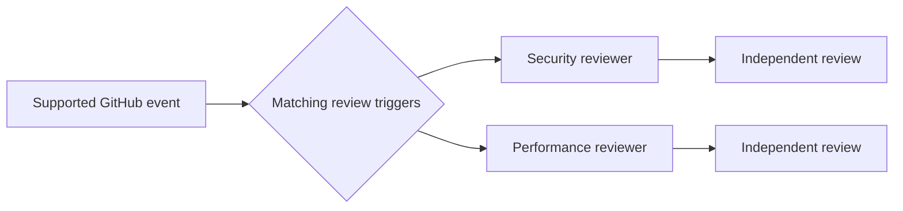
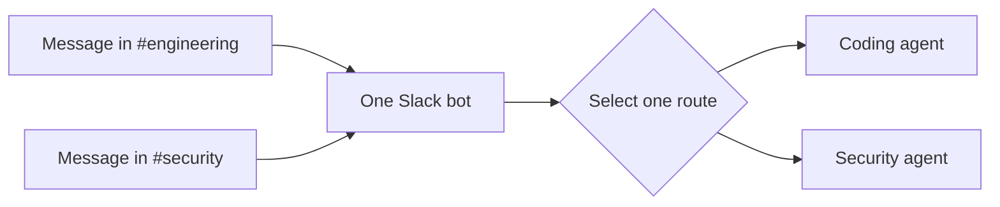

AgentConnect is designed for teams of specialized agents. For most teams, the best starting point is several focused agents, each connected to its own bot or integration. Add agent-to-agent delegation when those specialists need to work together.

Layered specialists are a common next step, especially for pull-request review. Trigger fan-out and shared-bot routing are useful when a workflow specifically needs parallel opinions or one consolidated platform identity.

| Starting point | Work mode | Agents run | Typical use |
| --- | --- | --- | --- |
| Default | Specialized agents | One addressed agent | A role-based agent team |
| Core collaboration | Agent delegation | Parent and workers | Coordinated subtasks |
| Common workflow | Layered specialists | One per request | Fast and deep PR review |
| Parallel analysis | Trigger fan-out | Several independently | Independent reviews |
| Advanced routing | Shared bot routing | One routed agent | One bot across channels |

The identity that appears on Slack or GitHub does not decide which resources an agent can access. Each agent keeps its own configuration and permission boundaries in every mode.

## Specialized agents

**Start here.** Create separate agents for distinct responsibilities, such as implementation, security review, support, and release operations. A person, schedule, webhook, or integration trigger addresses the appropriate agent directly.

Each path keeps its own integration identity, agent configuration, and session. The agents work independently until a workflow deliberately connects them.

Use this mode when the roles serve different teams or workflows and their outputs do not need to be combined. Start with [Create an agent](/docs/create-an-agent), then give each one a focused persona and environment under [Configure an agent](/docs/configure-an-agent).

## Agent-to-agent delegation

**Use this for collaboration.** One agent can assign bounded work to one or more policy-approved peers. A coordinator might ask separate agents to inspect security, tests, and migrations in parallel, collect their results, and return one summary to the team.

The caller remains the parent. Every worker runs with its own agent configuration in a separate child session. When the caller requests a result, the worker reports it to the parent session; the caller can then combine results or continue the workflow. A delegation can stay direct between agents or include a deliberate channel or thread post so the team sees the handoff.

The permission boundary is directional:

1. The caller's outbound policy must allow the worker.
2. The worker's inbound policy must allow the caller.
3. Both agents must belong to the same organization.

Platform membership is not agent-call authorization. A visible mention of another bot also does not wake an AgentConnect peer; it provides team-visible context or attribution around a delegation that AgentConnect authorizes and delivers separately.

Use this mode when one agent should own the plan and another should contribute a specific result. See [Agent visibility](/docs/agent-visibility) for the call policy and [Sessions](/docs/sessions) for transcript and audience boundaries.

## Layered or on-demand specialists

**Use this common pattern for PR review.** Give routine work to a fast agent and run a stronger specialist only when the task warrants it. Each request still selects one reviewer; the layers differ in cadence and depth rather than sharing one session.

A supported example is pull-request review: a fast reviewer can cover every revision, while a deep reviewer runs only when an authorized maintainer mentions its AgentConnect name. Both can use the same GitHub App, but they retain separate models, instructions, sessions, and review output. Mentioning the App itself is the broadcast form and can run all matching reviewers.

Use this mode when broad automatic coverage matters but expensive analysis should stay deliberate. Follow [Fast PR reviews with deep review on demand](/docs/fast-and-deep-pr-reviews).

## Parallel review or trigger fan-out

**Use this when you want independent opinions.** A supported integration can intentionally dispatch the same event to several agents. Each agent handles it independently in its own session; sharing a GitHub App does not merge their reasoning, permissions, or results.

GitHub review is the current example. An App-level mention can run every matching reviewer for the repository, while an agent-name mention targets one reviewer. **Re-run all checks** reruns the matching review Checks; an individual Check action targets that reviewer. The Check name identifies the AgentConnect agent even though GitHub shows the shared App as the actor.

Fan-out must be explicit in the integration and trigger configuration. Connecting several agents to the same repository or channel does not make every event a broadcast. AgentConnect rejects its own bot-authored comments and messages as new triggers so reviewers do not wake one another in a loop.

Use this mode when independent perspectives are more useful than a single coordinated answer. For a combined result, use delegation instead.

## Shared bot with contextual routing

**Use this as an advanced routing option.** Several agents can share one platform bot identity while channel and thread routing selects the agent for each inbound message. One message runs **one agent**; this is routing, not broadcast collaboration.

For example, one Slack App can route `#engineering` to a coding agent and `#security` to a review agent. Replies still appear from the shared Slack bot, but each AgentConnect agent keeps its own session, runtime, model, workspace, memory, tools, and permissions.

Use this mode only when people should remember one bot identity but different conversations need specialized behavior. For most teams, a separate bot for each agent is easier to understand and operate. Follow [One Slack app with different agents by channel](/docs/one-slack-app-across-channels).

## Cross-platform handoff is different

A single agent connected to Slack, Telegram, Discord, or Lark / Feishu can move a task between **two messaging workspaces you trust**. That is a cross-platform handoff, not multi-agent collaboration: the same agent owns both sides, and the source and destination remain separate linked sessions.

Follow [Hand off conversations between trusted workspaces](/docs/hand-off-conversations-across-messaging-platforms) before moving information across platform boundaries.

## Keep the permission layers separate

Combining work modes never combines their trust boundaries:

- **Platform access** controls which repositories, workspaces, channels, and people a bot or App can reach.
- **Team visibility** controls which people can find and manage an AgentConnect resource.
- **Agent visibility** controls which agents may call one another.
- **Session visibility** controls who may read a run and its transcript.
- **Runtime permissions and sandboxing** control what the running process may do.

See [Permissions](/docs/permissions-overview) for the complete model. A common composition is contextual routing to select a specialist, followed by explicit delegation when that specialist needs another agent's help.
