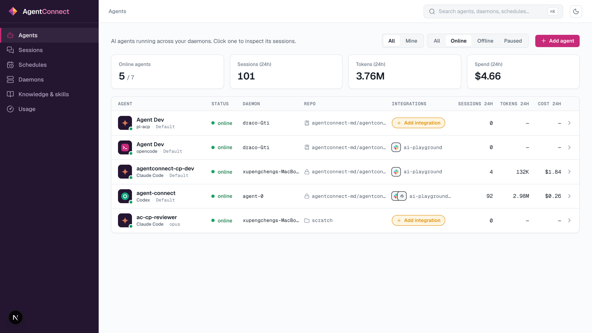

AgentConnect connects the chat tools your team already lives in — **Slack, Telegram, Discord, GitHub** — to AI coding agents like **Claude Code** and **Codex** running on **your own machines**.

You install a small daemon on any machine you control. It runs your agents locally and connects them to your channels. The AgentConnect console at [app.agentconnect.md](https://app.agentconnect.md) is where you configure agents, wire up integrations, and watch every session.

<Cards>
  <Card title="Quickstart" href="/docs/quickstart" icon="fa-duotone fa-rocket-launch">From sign-in to a working agent in about ten minutes</Card>

  <Card title="How it works" href="/docs/how-it-works" icon="fa-duotone fa-diagram-project">The daemon-centric architecture, and why your data stays yours</Card>

  <Card title="API Reference" href="/reference" icon="fa-duotone fa-code-simple">Automate everything the console does over REST</Card>
</Cards>

 

## What you can build

- **A reviewer in Slack** — mention the bot in a channel and it reviews the PR, using a clone of your repo on your own hardware.
- **A GitHub triager** — an agent that wakes up whenever an issue is opened and posts a first analysis as a comment.
- **A nightly report** — a schedule that runs an agent every morning and posts the result to a channel.
- **A deploy bot in Telegram or Discord** — chat-ops with a real coding agent behind it, not canned commands.

## The basics

<Cards>
  <Card kind="tile" title="Install the daemon" href="/docs/install-the-daemon" icon="fa-duotone fa-server">One command on any machine with Node 24+</Card>

  <Card kind="tile" title="Create an agent" href="/docs/create-an-agent" icon="fa-duotone fa-robot">Pick a runtime, a model and a workspace</Card>

  <Card kind="tile" title="Connect Slack" href="/docs/slack" icon="fa-duotone fa-hashtag">Two-step install, no public URL needed</Card>

  <Card kind="tile" title="Watch sessions" href="/docs/sessions" icon="fa-duotone fa-messages">Replay every run, tool call by tool call</Card>

  <Card kind="tile" title="Schedules" href="/docs/schedules" icon="fa-duotone fa-calendar-clock">Run agents on a timer</Card>

  <Card kind="tile" title="API keys" href="/docs/api-keys" icon="fa-duotone fa-key">Script the platform with personal keys</Card>
</Cards>
