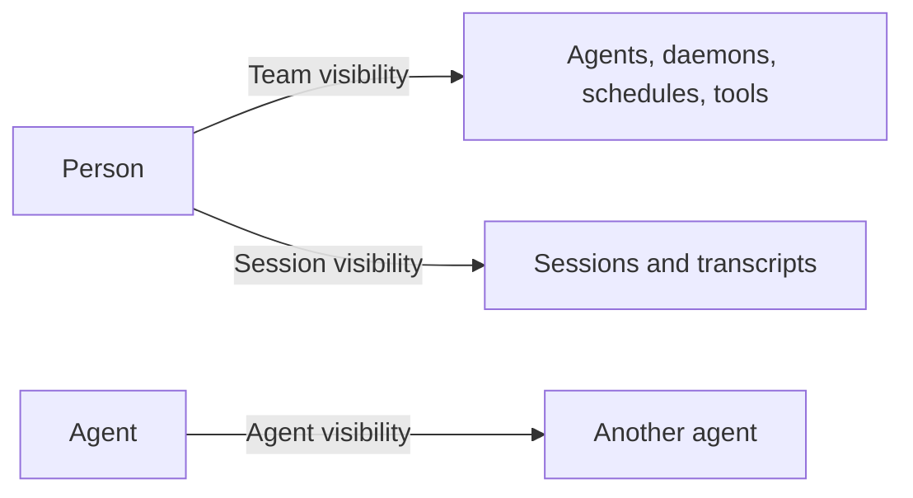

Everything in AgentConnect belongs to an **organization**. Membership is the outer boundary, and a member's [role](/docs/members-and-roles) decides what kind of actions they may take. Inside that boundary, three independent axes decide who reaches what:

All three are named *visibility*, so read them by their subject. Team visibility and Session visibility decide what a **person** may reach; Agent visibility decides which **agents** may call one another, and no person's access follows from it.

No axis inherits from another. Someone allowed to see an Agent cannot automatically read its sessions. Someone allowed to read a session does not gain the Agent's page, configuration, workspace, or invocation controls — the console may show the Agent's name as plain session context, never as a link. Allowing one agent to call another gives neither agent access to a resource that a person restricted.

## The three axes

Each axis has the same shape: an organization-wide default, and a per-resource choice that overrides it.

| Axis | Who reaches what | Organization default | Per-resource choice |
| --- | --- | --- | --- |
| [Team visibility](/docs/team-visibility) | A person → an agent, daemon, schedule, MCP provider, or skill source | Everyone | **Everyone** or **Selected** |
| [Session visibility](/docs/session-visibility) | A person → one session and its transcript | **Session access**, off by default | **Everyone** or **Private**; a provider audience is read-only |
| [Agent visibility](/docs/agent-visibility) | An agent → another agent | **Default agent visibility**, All agents by default | Inbound and outbound peer lists |

A role never overrides an audience. An organization Owner who is not selected cannot see a restricted resource, and a Private session has no Owner override either.

## Organization defaults

Two cards on the **Settings** page decide what new agents and new sessions start with. Only an organization Owner can change them, and they are the fastest way to make a whole organization open or closed by default.

### Default agent visibility

  

This card decides the agent-to-agent policy that new agents are created with:

- **All agents** — a new agent can discover and call every otherwise-callable peer, and accepts calls from all of them. Choose this when your agents work as one collaborative team.
- **Isolated** — a new agent starts as **Selected** with an empty list in both directions. It discovers no peers and accepts no peer calls until someone configures it. Choose this when every delegation edge should be deliberate.

The setting applies only to agents created after the change. It never rewrites an existing agent's policies, and **Add agent → Access** can still override either direction before creation. See [Agent visibility](/docs/agent-visibility).

### Session access

  

This card decides whether sessions from a platform follow that platform's own access rules instead of the normal per-origin default:

- **Off**, the default — each new session is **Everyone** or **Private** according to where it started. See the [default audience table](/docs/session-visibility#default-audience).
- **Follow Slack access** — a Slack channel or group-DM session requires a linked Slack identity from the same workspace with current access to the source conversation.
- **Follow GitHub access** — a private-repository session requires a linked GitHub profile with current access to that repository. Public-repository sessions stay available to every member.
- **Follow Feishu / Lark access** — the audience follows current membership in the source chat, including one-to-one chats. This currently requires a self-hosted deployment.

A provider audience is read-only on the session itself: change this organization setting rather than reclassifying one participant's copy. Every provider check needs a matching [linked account](/docs/linked-accounts); organization membership, the Owner role, and a personal API key do not substitute for it. See [Session visibility](/docs/session-visibility).

## Permissions that are separate

Several controls use similar words but protect different boundaries:

- An agent's **permission mode** controls what its runtime may do without asking during a run.
- [Sandboxing](/docs/sandboxing) places the runtime inside an outer Linux OS boundary and limits its filesystem access.
- A workspace's **repository access** controls whether the agent has Read only or Read & write access through the GitHub App.
- Platform app scopes control what a Slack, Discord, Telegram, Lark, or GitHub app may do at that provider.
- Tool, skill, secret, and daemon configuration controls what capabilities reach the agent process.

These controls compose with the axes above. Seeing an agent in the console does not grant write access to its repository, and allowing one agent to call another does not grant either agent access to a restricted team resource.

## A useful rule of thumb

Use roles for broad responsibility, Team visibility for direct access to team resources, Session visibility for transcript privacy, and Agent visibility for the agent-to-agent collaboration graph. Treat an Agent and its sessions as two separate authorization targets.
